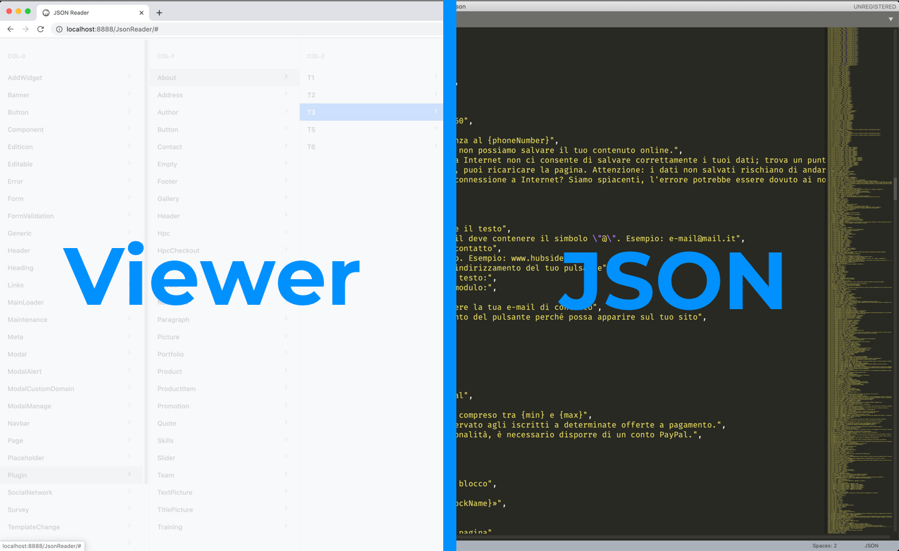
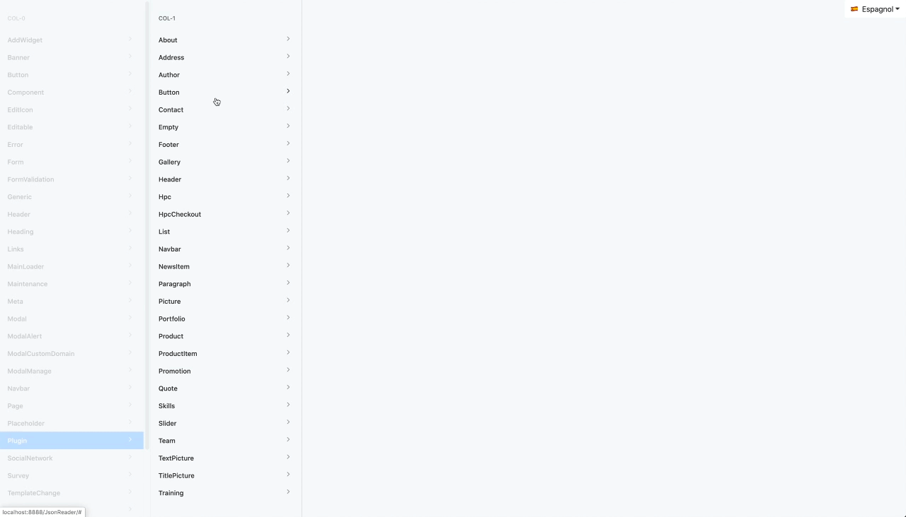
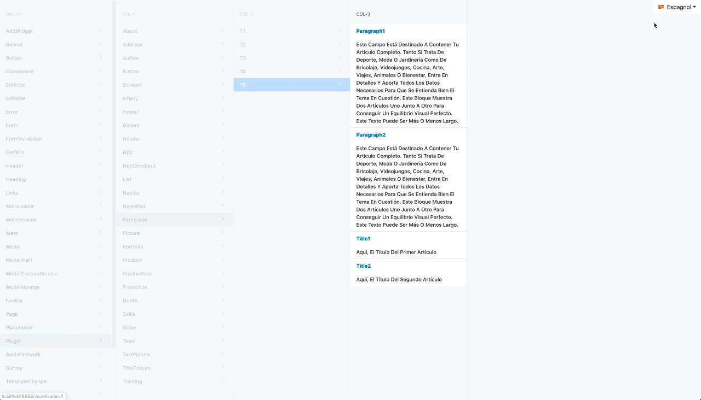

# traductionReader

## Navigate though json node
you can easily navigate though json Node and verify if there is a missing data in there

## Easy to copy
Primary objectif was to copy easily key, so that it can be exported faster

## Select langue from Data folder project
You can select add some language file in the data folder, the app detect it and you can use the dropdown menu to get content.

## XLF supported !
Your xlf file is supported and can be added in the data folder in the project. 

##TODO
• Clean foreach
• Clean Template $emit
• To store global sharing data VueX
• Url Set - vue router
